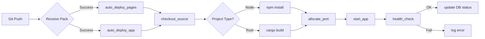

# Auto-Deploy Pipeline（自動部署流水線）

## 概述

Auto-Deploy Pipeline 是 Gitpage 的核心功能之一：當使用者推送（push）或提交（commit）程式碼後，系統自動偵測變更、建置（build）專案、部署（deploy）至 Pages（靜態網站）或 App（動態應用）託管平台。此機制類似 GitHub Pages、Vercel、Netlify 的 auto-deploy 體驗。

Gitpage 支援兩種觸發方式和兩種部署目標，形成 2×2 的矩陣：

| 觸發方式 | Pages 部署 | App 部署 |
|----------|-----------|---------|
| Git push（HTTP） | `auto_deploy_pages()` | `auto_deploy_app()` |
| Staging commit | `auto_deploy_pages()` | `auto_deploy_app()` |

## 觸發機制

### 1. Git Push 觸發

當 Git HTTP Smart Protocol 接收到 push 請求（`git-receive-pack`），在 `handle_git_backend()` 函數處理完畢後，檢查回應狀態碼。若成功（200/202），則以背景任務觸發部署：

```rust
if method == "POST" && rest_path.contains("git-receive-pack") {
    if status_code == 200 || status_code == 202 {
        let state = state.clone();
        tokio::spawn(async move {
            auto_deploy_pages(state.clone(), repo_id).await;
        });
        let state2 = state.clone();
        tokio::spawn(async move {
            auto_deploy_app(state2, repo_id).await;
        });
    }
}
```

此程式碼位於 `src/git/mod.rs` 的 `handle_git_backend()` 中。使用 `tokio::spawn` 確保部署操作不會阻塞 HTTP 回應。

### 2. Staging Commit 觸發

當使用者透過檔案管理器提交暫存區後，相同邏輯被觸發：

```rust
// src/handlers/files.rs
pub async fn commit_repo(...) -> Result<Json<Value>, AppError> {
    git::commit_staging(&repo, &staging_path, &branch, &message)?;
    // 背景部署
    tokio::spawn(auto_deploy_pages(state.clone(), repo_id));
    tokio::spawn(auto_deploy_app(state.clone(), repo_id));
    Ok(Json(json!({ "success": true })))
}
```

## 靜態 Pages 部署

### 原理

Pages 部署實作於 `src/git/mod.rs` 的 `deploy_pages()`。其核心是將 Git 儲存庫中特定目錄（預設根目錄 `/`，或設定為 `/docs`、`/dist`）的檔案提取到網頁伺服器可服務的目錄：

```
Git Repository (bare)          Pages Output Directory
├── index.html       ──────►   data/repos/{owner}/{repo}/pages/
├── about.md                    ├── index.html
├── dist/                       ├── about.html (rendered from .md)
│   └── bundle.js               ├── dist/
└── pages_config.json           │   └── bundle.js
                                └── ... (靜態檔案)
```

### 程式流程

```rust
pub fn deploy_pages(
    repo: &Repository,
    pages_dir: &Path,
    source_dir: &str,  // 預設 "/"
) -> Result<(), Box<dyn Error>> {
    // 1. 清理輸出目錄
    if pages_dir.exists() {
        fs::remove_dir_all(pages_dir)?;
    }
    fs::create_dir_all(pages_dir)?;

    // 2. 取得 HEAD commit 的 tree
    let head = repo.head()?.peel_to_commit()?;
    let tree = head.tree()?;

    // 3. 如果 source_dir != "/"，移到子樹
    let source_tree = if source_dir != "/" {
        let entry = tree.get_path(Path::new(source_dir.trim_start_matches('/')))?;
        repo.find_tree(entry.id())?
    } else {
        tree
    };

    // 4. 遞迴提取所有檔案到 pages 目錄
    extract_tree(repo, &source_tree, pages_dir, "")?;

    Ok(())
}

fn extract_tree(repo: &Repository, tree: &Tree, base_path: &Path, prefix: &str) -> Result<(), Error> {
    for entry in tree.iter() {
        let name = entry.name().unwrap_or("");
        let entry_path = base_path.join(name);

        match entry.kind() {
            Some(git2::ObjectType::Blob) => {
                let blob = repo.find_blob(entry.id())?;
                fs::write(&entry_path, blob.content())?;
            }
            Some(git2::ObjectType::Tree) => {
                fs::create_dir_all(&entry_path)?;
                let subtree = repo.find_tree(entry.id())?;
                extract_tree(repo, &subtree, &entry_path, "")?;
            }
            _ => {}
        }
    }
    Ok(())
}
```

## 動態 App 部署

### 部署流程

App 部署比 Pages 複雜得多，實作於 `src/deploy.rs` 的 `deploy_app()`：

```
checkout_source() → detect_project_type() → resolve_commands() → run_build() → start_app()
```

### 各階段詳解

#### 1. 提取原始碼（Checkout）

將 Git 儲存庫中的原始碼提取到工作目錄：

```rust
pub fn checkout_source(
    bare_repo_path: &Path,
    workspace_dir: &Path,
    source_dir: &str,
    branch: &str,
) -> Result<(), String> {
    // 使用 git checkout CLI（支援 bare repo 的 checkout）
    let status = Command::new("git")
        .args([
            "--git-dir", bare_repo_path.to_str().unwrap(),
            "--work-tree", workspace_dir.to_str().unwrap(),
            "checkout", branch, "--",
        ])
        .stdout(Stdio::null())
        .stderr(Stdio::null())
        .status();

    // 如果 source_dir != "/"，將子目錄移至 workspace 根目錄
    // ...
    Ok(())
}
```

#### 2. 專案類型偵測

檢查工作目錄中的檔案以決定建置方式：

```rust
pub fn detect_project_type(workspace_dir: &Path) -> String {
    let entries = fs::read_dir(workspace_dir).unwrap();
    for entry in entries {
        let name = entry.unwrap().file_name();
        if name == "package.json" { return "node".to_string(); }
        if name == "Cargo.toml" { return "rust".to_string(); }
        // 可擴展支援 Python、Go 等
    }
    "unknown".to_string()
}
```

#### 3. 命令解析

根據專案類型和 app config 中的覆蓋設定決定 build 和 start 命令：

```rust
pub fn resolve_commands(project_type: &str, config: &AppsConfig) -> (String, String) {
    match (project_type, &config.build_command, &config.start_command) {
        // 優先使用 config 中的自訂命令
        (_, Some(custom_build), Some(custom_start)) => {
            (custom_build.clone(), custom_start.clone())
        }
        // 根據專案類型使用預設命令
        ("node", _, _) => {
            ("npm install".to_string(), "npm start".to_string())
        }
        ("rust", _, _) => {
            (format!("cargo build --release"), format!("./target/release/{}", binary_name))
        }
        _ => return Err("不支援的專案類型".into()),
    }
}
```

#### 4. 建置（Build）

執行 build 命令，捕獲輸出作為 deploy log：

```rust
pub fn run_build(
    build_cmd: &str,
    workspace_dir: &Path,
    log_path: &Path,
    docker_mgr: Option<&DockerManager>,
    username: &str,
) -> Result<String, String> {
    if let Some(docker) = docker_mgr {
        // Docker 模式：在容器內執行
        let output = docker.exec_command(username, &["sh", "-c", build_cmd])?;
        fs::write(log_path, &output)?;
        Ok(output)
    } else {
        // Process 模式：本機執行
        let output = Command::new("sh")
            .args(["-c", build_cmd])
            .current_dir(workspace_dir)
            .output()?;
        let log = String::from_utf8_lossy(&output.stdout).to_string();
        fs::write(log_path, &log)?;
        Ok(log)
    }
}
```

#### 5. 啟動（Start）

建置完成後，在分配的埠啟動應用：

```rust
pub fn start_app(
    start_cmd: &str,
    workspace_dir: &Path,
    port: u16,
    docker_mgr: Option<&DockerManager>,
    username: &str,
    deploy_log_id: i64,
) -> Result<(), String> {
    match docker_mgr {
        Some(docker) => {
            // Docker 模式：使用 docker exec 啟動
            docker.exec_start_detached(username, start_cmd, port)?;
            // 健康檢查：ping 應用埠
            docker.exec_check_status(username, port)?;
        }
        None => {
            // Process 模式：建立子行程
            let mut child = Command::new("sh")
                .args(["-c", start_cmd])
                .env("PORT", port.to_string())
                .env("HOST", "0.0.0.0")
                .current_dir(workspace_dir)
                .stdout(Stdio::piped())
                .stderr(Stdio::piped())
                .spawn()?;

            let pid = child.id();
            // 註冊到 AppProcessManager（監控行程狀態）
            app_manager.register(pid, port)?;
            // 健康檢查：HTTP GET /health
        }
    }
    Ok(())
}
```

## 部署記錄（Deploy Logs）

每次部署會產生一個 `DeployLog` 記錄，儲存於 SQLite 資料庫的 `deploy_logs` 表：

```rust
pub struct DeployLog {
    pub id: i64,
    pub repo_id: i64,
    pub deploy_type: String,    // "pages" 或 "app"
    pub status: String,         // "running", "success", "failed"
    pub output: String,         // build 輸出文字
    pub created_at: String,
    pub completed_at: Option<String>,
}
```

流程圖：

```
[觸發事件]          [部署流程]              [資料庫記錄]
    │                  │                       │
    ├─ Git Push ──────► auto_deploy_*() ──────► INSERT deploy_logs (status=running)
    │                  │                       │
    ├─ Staging Commit ─┤                       │
    │                  ├─ checkout_source()     │
    │                  ├─ detect_project()      │
    │                  ├─ run_build() ──────────► UPDATE output
    │                  ├─ start_app()           │
    │                  │                       │
    │                  └─ success/fail ────────► UPDATE status
```

使用者可在前端 `/repo/:id/deploys` 檢視部署歷史，以及 `/repo/:id/deploys/:deployId` 查看單次部署的詳細輸出。

## 路由代理

部署完成後，透過 Axum 的 fallback handler 進行路由：

- `/pages/{user}/{repo}/*` → 從 `data/repos/{user}/{repo}/pages/` 提供靜態檔案
- `/app/{user}/{repo}/*` → 反向代理到 `127.0.0.1:{port}`（process 模式）或 Docker 容器 IP（Docker 模式）

## 背景任務的生命週期管理

使用 `tokio::spawn` 啟動的背景部署任務有以下特性：

1. **非阻塞**：HTTP 回應不會等待部署完成
2. **錯誤隔離**：單一部署失敗不影響其他操作
3. **無持久化**：伺服器重啟後，進行中的部署會消失
4. **無重試**：部署失敗不會自動重試

## 參考資料

- `src/git/mod.rs` — `deploy_pages()`, `handle_git_backend()` 中的觸發邏輯
- `src/deploy.rs` — `deploy_app()`, `run_build()`, `start_app()` 完整部署流程
- `src/app.rs` — `auto_deploy_pages()`, `auto_deploy_app()`, `resolve_owner_and_repo()`
- `src/handlers/apps.rs` — App config CRUD + do_deploy 手動觸發
- `src/handlers/pages.rs` — Pages config CRUD + deploy
- `src/db/models.rs` — `DeployLog` 資料結構

## 圖表


