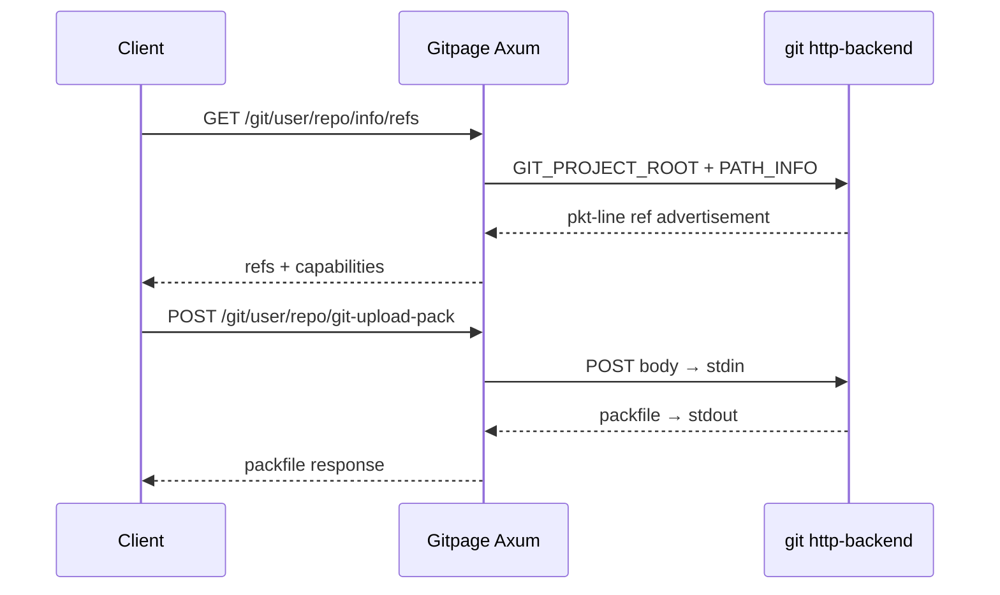

# Git HTTP Smart Protocol

## 概述

Git HTTP Smart Protocol 是 Git 版本控制系統透過 HTTP/HTTPS 進行資料傳輸的核心協定。與傳統的 Dumb HTTP Protocol（僅提供靜態檔案下載）不同，Smart Protocol 允許用戶端與伺服端進行雙向協商，僅傳送實際需要的差異資料，大幅提升 clone、push、pull 的效率。

在 Gitpage 專案中，所有遠端操作（clone、push、pull）均依賴此協定。系統透過 spawn `git http-backend` 子行程處理請求。

## 協定演進

### Dumb HTTP Protocol（早期）

最早的 Git 透過 HTTP 分享僅是簡單的檔案伺服器。伺服端只需在 bare repository 上啟用目錄列表，用戶端依序下載：

1. `info/refs` — 取得所有參照（分支、標籤）與對應的 SHA-1
2. 依 SHA-1 路徑下載物件（`objects/XX/XXXXXX...`）
3. 依需下載 packfile（`objects/pack/pack-*.pack`）

缺點明顯：每次 clone 都需要下載所有物件，無法差異傳輸，頻寬浪費嚴重。

### Smart Protocol（現代）

Git 1.6.6（2010 年）引入 Smart Protocol。其核心改進是引入**協商階段**（Negotiation Phase）：

1. **參照廣告**（Reference Discovery）：用戶端 GET `info/refs?service=git-upload-pack`，伺服端回傳所有參照及對應的 SHA-1，並以 pkt-line 格式封裝。
2. **協商**（Negotiation）：用戶端告知伺服端已擁有哪些物件（`have`），伺服端計算缺少的物件（`want`）。
3. **資料傳輸**（Data Transfer）：伺服端僅打包用戶端缺少的物件，以 packfile 格式傳送。

## pkt-line 格式

Smart Protocol 的所有通訊均使用 **pkt-line** 格式封裝。這是 Git 自訂的 framed 協定：

```
000ehello\n       ← 4 hex digits = 長度 (含4字元長度本身)
0011world\n       ← 17 bytes total
0000              ← flush packet，表示結束
```

- 每個 packet 以 4 個十六進位字元開頭，表示整包長度（含這 4 字元）
- `0000` 表示 flush（結束）
- 最大單包長度為 65520 bytes（`ffff`）

## Git HTTP Backend CGI

Git 提供 `git http-backend` 作為 CGI 程式，簡化伺服端實作。其運作方式：

### 環境變數驅動

`git http-backend` 從環境變數讀取請求資訊：

```bash
GIT_PROJECT_ROOT=/data/repos    # 裸倉庫根目錄
PATH_INFO=/user/repo.git/info/refs
QUERY_STRING=service=git-upload-pack
REQUEST_METHOD=GET
CONTENT_TYPE=application/x-git-upload-pack-request
CONTENT_LENGTH=1234
```

### 請求和回應格式

**智慧型 Fetch（clone/pull）：**

```
用戶端 → GET /repo.git/info/refs?service=git-upload-pack
          接受: application/x-git-upload-pack-advertisement

伺服端 ← 200 OK
          Content-Type: application/x-git-upload-pack-advertisement
          001e# service=git-upload-pack\n
          0000
          ...(參照廣告)...

用戶端 → POST /repo.git/git-upload-pack
          Content-Type: application/x-git-upload-pack-request
          0032want 7c5f5a4b8c3d2e1f0a9b8c7d6e5f4a3b2c1d0e\n
          0031have 0a1b2c3d4e5f6a7b8c9d0e1f2a3b4c5d6e7f8a9\n
          0000

伺服端 ← 200 OK
          Content-Type: application/x-git-upload-pack-result
          ...(packfile 資料)...
```

**智慧型 Push：**

```
用戶端 → GET /repo.git/info/refs?service=git-receive-pack

用戶端 → POST /repo.git/git-receive-pack
          Content-Type: application/x-git-receive-pack-request
          ...(參考更新 + packfile)...

伺服端 ← 200 OK
          ...(更新結果)...
```

## Gitpage 實作細節

在 `src/git/mod.rs` 中，`handle_git_backend()` 函數負責所有 git http-backend 的子行程管理：

### 環境變數映射

```rust
// 路徑解析：將 Axum 路由參數組合成 PATH_INFO
let path_info = format!("/{}/{}.git/{}", user, repo, rest_path.join("/"));

// 設定子行程環境
cmd.env("GIT_PROJECT_ROOT", format!("{}/repos", config.storage.base_path))
   .env("GIT_HTTP_EXPORT_ALL", "")  // 允許匯出所有倉庫（含私有）
   .env("PATH_INFO", &path_info)
   .env("QUERY_STRING", query_string)
   .env("REQUEST_METHOD", &method)
   .env("CONTENT_TYPE", content_type.unwrap_or(""))
   .env_remove("HTTP_CONTENT_ENCODING");
```

### 子行程通訊

Axum 的非同步特性與子行程的同步 I/O 之間需要橋接：

1. 從 HTTP 請求讀取 body（`axum::body::Bytes`）
2. 寫入子行程的 `stdin`
3. 從子行程的 `stdout` 讀取回應
4. 解析回應中的 HTTP 狀態碼、標頭和 body

```rust
let mut child = cmd.stdout(Stdio::piped())
                   .stdin(Stdio::piped())
                   .spawn()?;

// 寫入請求 body
child.stdin.take().unwrap().write_all(&body).await?;

// 讀取回應
let output = child.wait_with_output().await?;
```

### 回應解析

`git http-backend` 的回應格式為：

```
Status: 200 OK\r\n
Content-Type: application/x-git-upload-pack-result\r\n
\r\n
<binary data>
```

實作中將 stdout 的前幾行作為 HTTP 標頭解析，其餘作為 body：

```rust
// 將 stdout 分割為標頭和 body 兩部分
let stdout_str = String::from_utf8_lossy(&output.stdout);
if let Some(header_end) = stdout_str.find("\r\n\r\n") {
    let headers = &stdout_str[..header_end];
    let body = &output.stdout[header_end + 4..];
    // 解析 Status: 行取得 HTTP 狀態碼
    // 解析 Content-Type 等標頭
    // 回傳給用戶端
}
```

### Push 後自動部署

當請求方法是 `POST` 且路徑包含 `git-receive-pack` 時，表示是一次 push 操作。成功後觸發自動部署：

```rust
if method == "POST" && rest_path.contains("git-receive-pack") {
    if status_code == 200 || status_code == 202 {
        // 背景執行 pages 和 app 自動部署
        tokio::spawn(auto_deploy_pages(state, repo_id));
        tokio::spawn(auto_deploy_app(state, repo_id));
    }
}
```

## 安全考量

1. **路徑穿越防護**：確保 `PATH_INFO` 中的 `..` 不會導致存取非預期目錄
2. **私有倉庫授權**：在轉發給 `git http-backend` 之前，需驗證使用者是否有權限存取
3. **Content-Type 驗證**：確保 `git-upload-pack` 和 `git-receive-pack` 的 Content-Type 正確
4. **大小限制**：大型 packfile 可能耗盡記憶體，需設定緩衝區上限
5. **子行程清理**：確保子行程在逾時或錯誤時正確終止，避免殭屍行程

## 與 libgit2 的對比

| 面向 | git http-backend | libgit2 |
|------|-----------------|---------|
| 用途 | push/pull/clone 等遠端操作 | 讀取 tree、blob、commit log |
| 執行模式 | 子行程（外部程式） | 同行程（C 函式庫） |
| 優點 | 完整支援 Git 協定，無需重新實作 | 低延遲，無序列化開銷 |
| 缺點 | 序列化/反序列化開銷 | 部分操作（push）未實作 |
| 使用場景 | 所有遠端 Git 操作 | 網頁內容瀏覽、Pages 部署 |

## 參考資料

- [Git Protocol Documentation](https://git-scm.com/docs/http-protocol)
- [git-http-backend man page](https://git-scm.com/docs/git-http-backend)
- [Git Internals - Transfer Protocols](https://git-scm.com/book/en/v2/Git-Internals-Transfer-Protocols)
- `src/git/mod.rs` — Gitpage 的 git http-backend 實作

## 圖表


