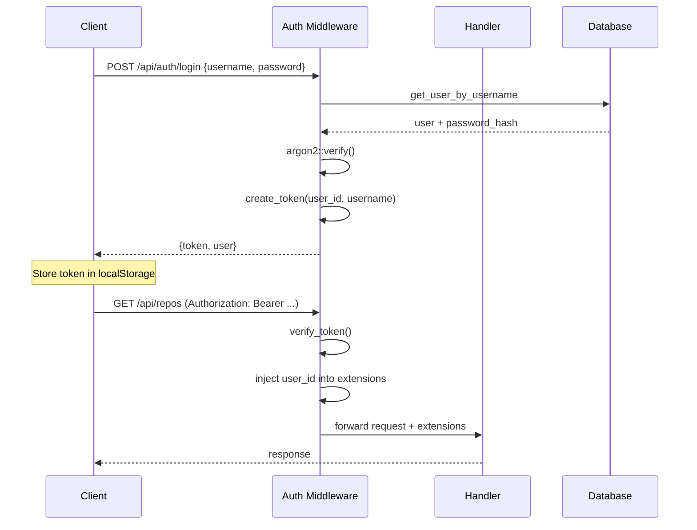

# JWT Authentication（JSON Web Token 認證）

## 概述

JSON Web Token（JWT）是一種開放標準（RFC 7519），定義了一種緊湊且獨立的方式，以 JSON 物件在各方之間安全地傳遞資訊。在 Gitpage 中，JWT 作為無狀態認證機制，使用者在登入後取得 Token，後續請求在 Authorization 標頭攜帶此 Token 進行身份驗證。

## JWT 結構

一個 JWT 由三個部分組成，以點（`.`）分隔：

```
header.payload.signature
```

### Header（標頭）

```json
{
  "alg": "HS256",
  "typ": "JWT"
}
```

- `alg`：簽章演算法，Gitpage 使用 HS256（HMAC with SHA-256）
- `typ`：Token 類型

### Payload（承載）

Gitpage 的 JWT payload 包含以下 claims：

```json
{
  "sub": "42",           // 使用者 ID（subject）
  "username": "alice",   // 使用者名稱
  "iat": 1680000000,     // 簽發時間（issued at）
  "exp": 1680086400      // 到期時間（expiration）
}
```

Claims 分為三類：

1. **Registered Claims**（註冊聲明）：`sub`、`iat`、`exp` 等預定義的 claim
2. **Public Claims**（公開聲明）：可自訂，如 `username`
3. **Private Claims**（私有聲明）：雙方約定的自訂資訊

### Signature（簽章）

簽章的計算方式為：

```
HMACSHA256(
  base64UrlEncode(header) + "." + base64UrlEncode(payload),
  secret
)
```

簽章確保 Token 在傳輸過程中未被篡改。

## Gitpage 的 JWT 實作

Gitpage 使用 `jsonwebtoken` crate 處理 JWT 的建立與驗證，實作於 `src/auth/mod.rs`。

### 全域密鑰管理

採用 Rust 的 `OnceLock` 模式實現全域 JWT 密鑰：

```rust
static JWT_SECRET: OnceLock<String> = OnceLock::new();

pub fn init_jwt_secret(config_secret: &str) {
    // 優先使用 JWT_SECRET 環境變數，否則使用 config 設定
    let secret = std::env::var("JWT_SECRET")
        .unwrap_or_else(|_| config_secret.to_string());
    JWT_SECRET.set(secret).ok();
}
```

### Token 建立

```rust
use jsonwebtoken::{encode, Header, EncodingKey};

pub fn create_token(user_id: i64, username: &str, expires_in_hours: u64) -> Result<String, AppError> {
    let now = chrono::Utc::now();
    let claims = Claims {
        sub: user_id.to_string(),
        username: username.to_string(),
        iat: now.timestamp() as usize,
        exp: (now + chrono::Duration::hours(expires_in_hours as i64)).timestamp() as usize,
    };

    let secret = JWT_SECRET.get().ok_or_else(|| {
        AppError::Internal("JWT 密鑰未初始化".into())
    })?;

    let token = encode(
        &Header::default(),          // HS256 + JWT
        &claims,
        &EncodingKey::from_secret(secret.as_bytes()),
    )?;

    Ok(token)
}
```

### Token 驗證

```rust
use jsonwebtoken::{decode, Validation, DecodingKey};

pub fn verify_token(token: &str) -> Result<Claims, AppError> {
    let secret = JWT_SECRET.get().ok_or_else(|| {
        AppError::Internal("JWT 密鑰未初始化".into())
    })?;

    let token_data = decode::<Claims>(
        token,
        &DecodingKey::from_secret(secret.as_bytes()),
        &Validation::default(),      // 驗證 exp, sub, iss 等
    )?;

    Ok(token_data.claims)
}
```

### Claims 結構

```rust
#[derive(Debug, Serialize, Deserialize)]
pub struct Claims {
    pub sub: String,         // 使用者 ID（字串形式）
    pub username: String,    // 使用者名稱
    pub iat: usize,          // 簽發時間
    pub exp: usize,          // 到期時間
}
```

## 認證中間件（Auth Middleware）

在 `src/app.rs` 中，Axum 的中間件負責攔截請求並驗證 JWT：

```rust
async fn auth_middleware<B>(
    mut req: Request<B>,
    next: Next<B>,
) -> Result<Response<Body>, AppError> {
    // 1. 判斷是否為公開路徑
    if is_public_path(req.uri().path(), req.method()) {
        return Ok(next.run(req).await);
    }

    // 2. 從 Authorization 標頭提取 Token
    let auth_header = req.headers()
        .get("Authorization")
        .and_then(|v| v.to_str().ok())
        .and_then(|v| v.strip_prefix("Bearer "))
        .ok_or(AppError::Unauthorized("需要登入".into()))?;

    // 3. 驗證 Token
    let claims = verify_token(auth_header)?;

    // 4. 將使用者資訊注入請求擴充
    req.extensions_mut().insert(claims.user_id.parse::<i64>().unwrap());
    req.extensions_mut().insert(claims.username.clone());

    Ok(next.run(req).await)
}
```

### 公開路徑

以下路徑無需認證：

- `POST /api/auth/register` — 註冊
- `POST /api/auth/login` — 登入
- `GET /api/repos`（公開倉庫搜尋）
- `GET /api/:username/:repo/tree` — 公開倉庫內容
- `GET /api/:username/:repo/blob` — 公開倉庫檔案
- `GET /api/:username/:repo/readme` — 公開倉庫 README
- `GET /api/:username/:repo/commits/:branch` — 公開倉庫提交記錄
- `GET /api/users/:username/repos` — 公開使用者倉庫清單
- `OPTIONS *` — CORS preflight
- 所有非 `/api/*` 路徑（靜態檔案或前端）

## 安全性設計

### Token 儲存

前端將 Token 儲存在 `localStorage`：

```typescript
// frontend/src/api.ts
export function setToken(token: string) {
    localStorage.setItem('token', token);
}

export function getToken(): string | null {
    return localStorage.getItem('token');
}

// 每次請求自動帶入
export async function request<T>(method: string, path: string, body?: unknown): Promise<T> {
    const token = getToken();
    const headers: Record<string, string> = {};
    if (token) headers['Authorization'] = `Bearer ${token}`;
    if (body) headers['Content-Type'] = 'application/json';
    // ...
}
```

### 到期機制

Token 預設在設定時間後到期（config 中 `[jwt] expires_in_hours`，通常為 1 小時）。到期後需重新登入取得新 Token。目前未實作 refresh token 機制。

### 安全風險與緩解

| 風險 | 說明 | 緩解措施 |
|------|------|---------|
| Token 竊取 | XSS 攻擊取得 localStorage Token | 輸入消毒，Content-Security-Policy |
| Token 偽造 | 攻擊者取得密鑰 | 密鑰儲存在 config/env，不洩漏 |
| Token 重放 | 攔截請求重複發送 | 短到期時間（數小時） |
| 暴力破解 | 嘗試偽造簽章 | HS256 使用 256-bit 密鑰 |
| 無效 Token | 登出後仍可使用 | 實際需黑名單機制（尚未實作） |

## JWT vs Session Based Auth

| 特性 | JWT（無狀態） | Session（有狀態） |
|------|-------------|-----------------|
| 儲存位置 | 用戶端 | 伺服端記憶體/資料庫 |
| 擴展性 | 不需共享 session store | 需集中式 session store |
| 撤銷 | 困難（需黑名單） | 簡單（刪除 session） |
| 頻寬 | 較大（Token 含完整 payload） | 較小（僅 session ID） |
| 實作複雜度 | 低 | 中等 |

Gitpage 選擇 JWT 主要考量是實作簡單且無需資料庫查詢認證狀態。

## 與 Axum Extension 的整合

Axum 的 `Extension` 提取器允許中間件將資料注入 handler：

```rust
// 中間件注入
req.extensions_mut().insert(user_id);

// Handler 接收
pub async fn get_repo(
    State(state): State<AppState>,
    axum::Extension(user_id): axum::Extension<i64>,  // 從中間件取得
    Path(repo_id): Path<i64>,
) -> Result<Json<Value>, AppError> {
    // 使用 user_id 進行權限檢查
    let repo = state.db.get_repo(repo_id)?;
    if repo.is_private {
        check_access(&state.db, user_id, &repo)?;
    }
    Ok(Json(json!({ "repo": repo })))
}
```

## 參考資料

- [RFC 7519 - JSON Web Token](https://tools.ietf.org/html/rfc7519)
- [JWT.io](https://jwt.io/)
- [jsonwebtoken crate](https://crates.io/crates/jsonwebtoken)
- [Axum Extension Documentation](https://docs.rs/axum/latest/axum/extract/struct.Extension.html)
- `src/auth/mod.rs` — JWT create/verify 實作
- `src/app.rs` — auth_middleware 中間件
- `frontend/src/api.ts` — 前端 Token 管理

## 圖表


