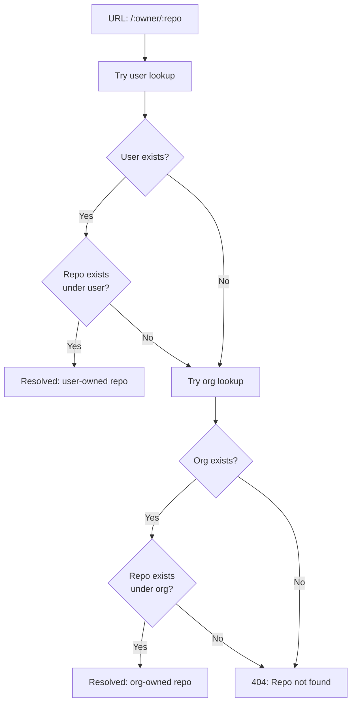

# Owner Resolution（擁有者解析模式）

## 概述

Owner Resolution 是 Gitpage 中一個關鍵的設計模式：任何一個 Repository 可以屬於**使用者**（User）或**組織**（Organization），而系統需要根據 URL 中的使用者名稱動態決定其歸屬。這種解析模式影響到檔案系統路徑計算、路由決策、權限檢查等多個方面。

## 問題描述

### 雙重擁有權模型

Gitpage 的 Repository 模型：

```rust
pub struct Repository {
    pub id: i64,
    pub owner_id: i64,         // 使用者的 user_id 或組織的 org_id
    pub owner_type: String,    // "user" 或 "org"
    pub name: String,
    pub description: Option<String>,
    pub is_private: bool,
    pub created_at: String,
    pub updated_at: String,
    // ... 其他欄位
}
```

當使用者造訪 `https://gitpage.example.com/alice/myproject/src/main.rs` 時，`alice` 可能是：

1. 使用者「alice」的個人專案
2. 組織「alice」的專案

系統需要先嘗試使用者，再嘗試組織，或根據上下文決定優先順序。

### 路徑計算的複雜性

不同的路徑取決於擁有者名稱：

```
data/
├── repos/alice/myproject.git      ← alice 是使用者或組織
├── staging/alice/myproject/       ← 同上
└── apps/alice/myproject/          ← 同上
```

`Config` 的路徑方法：

```rust
impl Config {
    pub fn repo_path(&self, owner: &str, repo: &str) -> PathBuf {
        PathBuf::from(&self.storage.base_path)
            .join("repos").join(owner).join(format!("{}.git", repo))
    }

    pub fn staging_path(&self, owner: &str, repo: &str) -> PathBuf {
        PathBuf::from(&self.storage.base_path)
            .join("staging").join(owner).join(repo)
    }

    pub fn app_workspace_dir(&self, owner: &str, repo: &str) -> PathBuf {
        PathBuf::from(&self.storage.base_path)
            .join("apps").join(owner).join(repo)
    }
}
```

## 解析策略

### 順序解析（先使用者後組織）

Gitpage 採用**先查使用者，再查組織**的解析策略，在 `resolve_repo()` 中實現：

```rust
// src/handlers/content.rs
fn resolve_repo(
    db: &Database,
    owner_name: &str,
    repo_name: &str,
) -> Result<(Repository, String), AppError> {
    // 1. 先嘗試使用者
    if let Some(user) = db.get_user_by_username(owner_name)? {
        if let Some(repo) = db.get_repo_by_user_and_name(user.id, repo_name)? {
            return Ok((repo, owner_name.to_string()));
        }
    }

    // 2. 再嘗試組織
    if let Some(org) = db.get_org_by_name(owner_name)? {
        if let Some(repo) = db.get_repo_by_org_and_name(org.id, repo_name)? {
            return Ok((repo, owner_name.to_string()));
        }
    }

    Err(AppError::NotFound("儲存庫不存在".into()))
}
```

### 資料庫查詢

對應的資料庫查詢：

```sql
-- 使用者擁有的倉庫
SELECT r.* FROM repositories r
JOIN users u ON r.owner_id = u.id AND r.owner_type = 'user'
WHERE u.username = ?1 AND r.name = ?2;

-- 組織擁有的倉庫
SELECT r.* FROM repositories r
JOIN organizations o ON r.owner_id = o.id AND r.owner_type = 'org'
WHERE o.name = ?1 AND r.name = ?2;
```

### 在路由中的應用

在 `src/app.rs` 的 fallback handler 和路由中，同樣需要解析擁有者：

```rust
// 一般的路由參數為 :username，不區分使用者或組織
pub async fn list_tree(
    State(state): State<AppState>,
    Path((username, repo_name)): Path<(String, String)>,
    Query(params): Query<TreeParams>,
) -> Result<Json<Value>, AppError> {
    // 1. 解析擁有者
    let (repo, owner_name) = resolve_repo(&state.db, &username, &repo_name)?;

    // 2. 計算實際的 Git 路徑
    let git_path = state.config.repo_path(&owner_name, &repo.name);

    // 3. 使用 libgit2 讀取 tree
    let entries = git::list_directory(&git_path, &params.branch, &params.path)?;

    Ok(Json(json!({ "repo": repo, "entries": entries })))
}
```

## 所有權限檢查

擁有者解析也影響權限判斷：

```rust
fn check_repo_access(
    db: &Database,
    repo: &Repository,
    user_id: Option<i64>,
) -> Result<(), AppError> {
    if !repo.is_private {
        return Ok(()); // 公開倉庫所有人都可讀
    }

    let user_id = user_id.ok_or(AppError::Unauthorized("需要登入"))?;

    match repo.owner_type.as_str() {
        "user" => {
            // 使用者擁有的倉庫：本人或協作者可存取
            if repo.owner_id != user_id {
                if !db.is_collaborator(repo.id, user_id)? {
                    return Err(AppError::Unauthorized("沒有存取權限"));
                }
            }
        }
        "org" => {
            // 組織擁有的倉庫：成員或協作者可存取
            if !db.is_org_member(repo.owner_id, user_id)?
                && !db.is_collaborator(repo.id, user_id)? {
                return Err(AppError::Unauthorized("沒有存取權限"));
            }
        }
        _ => return Err(AppError::BadRequest("未知的擁有者類型")),
    }

    Ok(())
}
```

## 自動部署中的擁有者解析

Push 後的部署也需正確解析擁有者：

```rust
// src/app.rs
async fn auto_deploy_pages(state: AppState, repo_id: i64) {
    let repo = state.db.get_repo(repo_id).unwrap();
    let owner_name = match repo.owner_type.as_str() {
        "user" => {
            state.db.get_user(repo.owner_id).unwrap().username
        }
        "org" => {
            state.db.get_org(repo.owner_id).unwrap().name
        }
        _ => return,
    };

    let pages_dir = state.config.pages_dir(&owner_name, &repo.name);
    // 執行部署...
}
```

## 組織 vs 使用者：建立時的選擇

建立倉庫時，使用者可選擇擁有者類型：

```rust
// src/handlers/repos.rs
pub async fn create_repo(
    State(state): State<AppState>,
    axum::Extension(user_id): axum::Extension<i64>,
    Json(body): Json<CreateRepoRequest>,
) -> Result<Json<Value>, AppError> {
    let (owner_id, owner_type, owner_name) = if let Some(ref org_name) = body.org_name {
        // 在組織下建立倉庫
        let org = state.db.get_org_by_name(org_name)?
            .ok_or(AppError::NotFound("組織不存在"))?;
        // 驗證使用者是否為組織管理員
        let role = state.db.get_user_org_role(org.id, user_id)?
            .ok_or(AppError::Forbidden("你不是組織成員"))?;
        if role != "admin" {
            return Err(AppError::Forbidden("需要管理員權限"));
        }
        (org.id, "org".to_string(), org.name)
    } else {
        // 在使用者名下建立倉庫
        let user = state.db.get_user(user_id)?;
        (user_id, "user".to_string(), user.username)
    };

    // 建立倉庫（包含 bare repo 和 staging 目錄）
    let repo = state.db.create_repo(owner_id, &owner_type, &body.name, ...)?;
    git::init_bare_repo(&state.config.repo_path(&owner_name, &body.name))?;
    fs::create_dir_all(&state.config.staging_path(&owner_name, &body.name))?;

    Ok(Json(json!({ "repo": repo })))
}
```

## 檔案系統路徑對比

| 擁有者類型 | 範例路徑 |
|-----------|---------|
| 使用者 alice | `data/repos/alice/myproject.git` |
| 組織 myteam | `data/repos/myteam/myproject.git` |
| 使用者 alice（staging） | `data/staging/alice/myproject/` |
| 組織 myteam（staging） | `data/staging/myteam/myproject/` |

## URL 路由對比

| URL | 解析結果 |
|-----|---------|
| `/alice/repo1/tree/main` | 先查使用者 alice，找到 repo1 |
| `/myteam/repo1/tree/main` | 查使用者 myteam 不存在，改查組織 myteam |
| `/users/alice` | 明確指向使用者 |
| `/orgs/myteam` | 明確指向組織 |

## 資料庫索引

為確保查詢效率，資料庫建立了複合索引：

```sql
-- 使用者倉庫查詢
CREATE UNIQUE INDEX IF NOT EXISTS idx_repos_user_name
ON repositories(owner_id, name) WHERE owner_type = 'user';

-- 組織倉庫查詢
CREATE UNIQUE INDEX IF NOT EXISTS idx_repos_org_name
ON repositories(owner_id, name) WHERE owner_type = 'org';

-- 使用者名稱查詢
CREATE UNIQUE INDEX IF NOT EXISTS idx_users_username ON users(username);

-- 組織名稱查詢
CREATE UNIQUE INDEX IF NOT EXISTS idx_orgs_name ON organizations(name);
```

## 參考資料

- `src/handlers/content.rs` — `resolve_repo()` 實作
- `src/app.rs` — `resolve_owner_and_repo()` 與 `auto_deploy_*()`
- `src/db/mod.rs` — 使用者/組織/倉庫的資料庫查詢
- `src/handlers/repos.rs` — 倉庫建立（擁有者選擇）
- `src/db/models.rs` — Repository 資料結構（owner_type, org_id）

## 圖表


