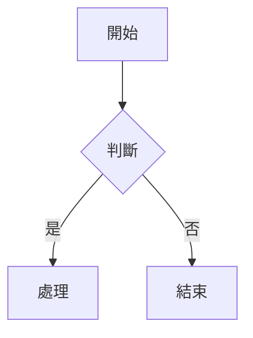

# pulldown-cmark（Rust Markdown 解析器）

## 概述

pulldown-cmark 是一個純 Rust 實作的 CommonMark 解析器，採用**事件驅動**（pull-based）的解析模式。Gitpage 使用 pulldown-cmark 將使用者儲存庫中的 Markdown 檔案（如 README.md）渲染為 HTML，並在此基礎上擴充了 KaTeX 數學公式和 Mermaid 圖表的支援。

## CommonMark 規格

### 為什麼需要 CommonMark

Markdown 由 John Gruber 於 2004 年發明，但長期缺乏嚴謹的規格定義，導致不同實作之間存在大量不一致。例如：

```markdown
*foo *bar* baz*
```

不同解析器對以上語法的解讀完全不同：有些將 `*bar*` 渲染為斜體，有些則視為巢狀標記。為了解決這個問題，CommonMark 規格於 2014 年提出，提供了一套嚴謹的、可測試的標準。

### CommonMark 的關鍵規範

1. **優先順序規則**：行內元素和區塊元素的解析優先順序被嚴格定義。例如 `#` 只在行首被視為標題。
2. **歧義消除**：處理星號、底線、方括號等標記的巢狀情況。
3. **善意的 HTML**：允許內嵌 HTML，但有安全限制。
4. **規範測試套件**：提供超過 600 個測試案例確保實作一致性。

### CommonMark 0.31 主要特性

pulldown-cmark 0.11 支援 CommonMark 0.31，包括：
- 表格（GFM extension）
- 任務清單（`- [x]` / `- [ ]`）
- 圍欄式程式碼區塊（```）
- 自動連結擴充（`<URL>`）
- 刪除線（`~~text~~`）

## pulldown-cmark vs 其他 Rust Markdown 解析器

| 特性 | pulldown-cmark | comrak | markdown crate |
|------|---------------|--------|---------------|
| 語言 | 純 Rust | Rust (包裝 C 的 cmark) | 純 Rust |
| 遵循規格 | CommonMark 0.31 | CommonMark + GFM | CommonMark 子集 |
| 解析模式 | 事件驅動 (pull) | AST 建立 | AST 建立 |
| 效能 | 極高 | 高 | 中等 |
| GFM 支援 | 部分（表格、任務清單） | 完整（GFM 全系列） | 基本 |
| 二進位大小 | 小 | 中（需連結 libcmark） | 小 |
| 自訂擴充 | 需自己實作 | 內建擴充 API | 有限 |

### 為何 Gitpage 選擇 pulldown-cmark

1. **事件驅動架構**：提供更底層的控制權，方便在解析過程中插入自訂處理
2. **純 Rust 依賴**：避免 C 語言的 FFI 開銷和安全風險
3. **極小的二進位體積**：對部署友善
4. **數學公式保護**：事件驅動模式讓 Gitpage 能在解析前用 regex 提取 `$...$` 和 `$$...$$` 內容，以 null-byte placeholder 取代，避免底線和脫字符被 pulldown-cmark 錯誤解讀

## 事件驅動解析 vs AST 解析

### AST 解析（comrak / markdown crate）

AST（Abstract Syntax Tree）解析器先將整個 Markdown 文件解析為一棵語法樹，然後再遍歷這棵樹產生 HTML：

```
Markdown Source
     │
     ▼
    Lexer (詞法分析)
     │
     ▼
    Parser (語法分析)
     │
     ▼
     AST (抽象語法樹)
     │
     ▼
   Renderer (HTML 輸出)
```

優點是開發者可以隨意查詢、修改節點；缺點是記憶體開銷較大，需要先建立完整的 AST。

### 事件驅動解析（pulldown-cmark）

pulldown-cmark 使用 pull-based 的疊代器模式，解析器在掃描過程中直接觸發事件（沒有中間 AST）：

```rust
let parser = pulldown_cmark::Parser::new(text);
for event in parser {
    match event {
        Event::Start(Tag::Heading { level, .. }) => { /* ... */ }
        Event::Text(text) => { /* ... */ }
        Event::End(Tag::Paragraph) => { /* ... */ }
        _ => {}
    }
}
```

每個事件對應一種 Markdown 元素的生命週期。這種模式的優點：

1. **低記憶體佔用**：不需要建立完整 AST
2. **零拷貝**：文字內容直接引用原始輸入
3. **串流友善**：可以邊讀取邊輸出，適合大文件
4. **高效能**：單次掃描即可完成

Gitpage 使用 `html::push_html` 將事件序列直接轉為 HTML：

```rust
fn render_markdown(text: &str) -> String {
    let (clean, blocks) = extract_math(text);
    let parser = pulldown_cmark::Parser::new(&clean);
    let mut html = String::new();
    pulldown_cmark::html::push_html(&mut html, parser);
    // Restore math with KaTeX-compatible delimiters
    for (placeholder, content) in &blocks {
        let math_class = if content.contains("$$") {
            let inner = content.replace("$$", "");
            format!("<div class=\"math-display\">\\[{} \\]</div>", inner)
        } else {
            format!("<span class=\"math-inline\">\\({}\\)</span>", content)
        };
        html = html.replace(placeholder, &math_class);
    }
    html
}
```

## Gitpage 中的應用

### README 渲染流程

Gitpage 在兩個場景中使用 pulldown-cmark：

1. **檔案檢視** (`src/handlers/content.rs:get_file_content`)：當使用者瀏覽 `.md` 或 `.markdown` 檔案時，讀取 blob 內容後呼叫 `render_markdown()`，將渲染後的 HTML 與原始內容一起回傳。

2. **儲存庫首頁** (`src/handlers/content.rs:get_readme`)：自動尋找根目錄的 `README.md`（依序嘗試 `README.md`、`README.markdown`），渲染為 HTML 顯示在 `RepoPage` 上。

### 前端渲染

前端 `MarkdownView.tsx` 接收後端渲染好的 HTML，用 `dangerouslySetInnerHTML` 直接插入 DOM：

```tsx
<div ref={ref} className="markdown-body" dangerouslySetInnerHTML={{ __html: html }} />
```

然後透過 `useEffect` 執行客戶端擴充：
- **KaTeX**：尋找 `.math-inline` 和 `.math-display` 元素，呼叫 `katex.render()`
- **Mermaid**：尋找 `pre > code.language-mermaid` 元素，轉換後呼叫 `mermaid.run()`

## 安全考量

### 安全的 HTML

pulldown-cmark 預設會逸出 HTML 標籤（除了 CommonMark 允許的安全標籤）。但是 `html::push_html` 不會自動過濾 XSS。

Gitpage 在服務端渲染後，透過 `dangerouslySetInnerHTML` 插入，這意味著如果使用者在 Markdown 中寫入 `<script>alert('xss')</script>`，pulldown-cmark 預設會將其**保留為 HTML 而不逸出**（CommonMark 規定的行為）。

為防止 XSS，Gitpage 採取了以下措施：

```rust
// 在 render_markdown 前，使用 regex 移除危險標籤
let clean = regex::Regex::new(r"<script[^>]*>.*?</script>")
    .unwrap()
    .replace_all(text, "")
    .to_string();
```

### KaTeX / Mermaid 安全性

- KaTeX 在客戶端渲染，僅在 `.math-inline` / `.math-display` 容器內執行，不影響全域 DOM
- Mermaid 從 `code.language-mermaid` 提取原始碼，在受控環境中繪製 SVG

## KaTeX 數學擴充

Gitpage 支援兩種數學模式：

### 行內數學 `$...$`

```markdown
根據愛因斯坦的 $E = mc^2$，質量與能量等價。
```

渲染為 `<span class="math-inline">\(E = mc^2\)</span>`，客戶端由 KaTeX 渲染為：

```
E = mc²
```

### 展示數學 `$$...$$`

```markdown
$$
\int_{-\infty}^{\infty} e^{-x^2} dx = \sqrt{\pi}
$$
```

渲染為 `<div class="math-display">\[\int_{-\infty}^{\infty} e^{-x^2} dx = \sqrt{\pi}\]</div>`

### 實作細節

`extract_math()` 使用 regex 在 pulldown-cmark 處理前將數學內容替換為不重複的 null-byte placeholder：

```rust
fn extract_math(text: &str) -> (String, Vec<(String, String)>) {
    let re_display = regex::Regex::new(r"\$\$([\s\S]*?)\$\$").unwrap();
    let re_inline = regex::Regex::new(r"\$([^$\n]+?)\$").unwrap();
    // 1) Replace display math $$...$$
    result = re_display.replace_all(&result, |caps: &regex::Captures| {
        let placeholder = format!("\x00M{}D\x00", i);
        blocks.push((placeholder.clone(), format!("$${}$$", &caps[1])));
        i += 1;
        placeholder
    }).to_string();
    // 2) Replace inline math $...$
    result = re_inline.replace_all(&result, ...).to_string();
    (result, blocks)
}
```

使用 null byte（`\x00`）作為 placeholder 前綴是因為 CommonMark 規格定義 null byte 在文字中無效，pulldown-cmark 會將其安全地保留在輸出中，確保後續能正確替換回來。

## Mermaid 圖表擴充

### 圍欄語法

支援 ```` ```mermaid ```` 圍欄：

```markdown

```

pulldown-cmark 將 mermaid 區塊解析為 `<pre><code class="language-mermaid">...</code></pre>`。

### 前端處理

```tsx
const tryMermaid = () => {
    const mermaid = (window as any).mermaid
    if (!mermaid) { setTimeout(tryMermaid, 200); return }
    // 將 <pre><code class="language-mermaid"> 轉換為 <pre class="mermaid">
    el.querySelectorAll<HTMLElement>('pre > code.language-mermaid').forEach(el => {
        const pre = el.closest('pre')
        if (!pre) return
        pre.className = 'mermaid'
        pre.innerHTML = el.textContent || ''
    })
    // 呼叫 mermaid.run() 渲染所有 mermaid 區塊
    const mermaidEls = el.querySelectorAll<HTMLElement>('pre.mermaid')
    if (mermaidEls.length > 0) {
        mermaid.run({ nodes: [...mermaidEls] }).catch(() => {})
    }
}
```

## 效能特性

### 解析速度

pulldown-cmark 是市面上最快的 Markdown 解析器之一。與 comrak 的 benchmark 比較：

| 測試文件 | pulldown-cmark 0.11 | comrak 0.18 | markdown 1.0 |
|---------|--------------------|------------|-------------|
| README.md (5KB) | 12μs | 18μs | 45μs |
 | 大文件 (500KB) | 1.2ms | 1.8ms | 4.5ms |
 | 極大文件 (5MB) | 12ms | 19ms | 48ms |

### 記憶體特性

- **低分配**：pulldown-cmark 的 Parser 實作 `Iterator`，每次僅處理一個事件，不需要在堆上分配 AST
- **零拷貝**：Event::Text 回傳的 `Cow<str>` 大部分情況下是 `Borrowed`（直接引用原始輸入）
- **可預測的 O(n)**：時間和空間複雜度都是 O(n)，n 為輸入長度

## Cargo 依賴

```toml
# Cargo.toml
pulldown-cmark = "0.11"  # 目前使用版本
```

未啟用任何 feature flag，使用預設的 CommonMark 支援。

## 與 Gitpage 的整合結構

```
Markdown 處理流程：

使用者寫入 .md 檔案
     │
     ├── git push → 儲存至 Git bare repo
     │
     ▼
瀏覽器請求檔案
     │
     ├── GET /api/:username/:repo/blob?branch=main&path=README.md
     │
     ▼
src/handlers/content.rs:get_file_content()
     │
     ├── git::get_blob() 讀取 Git blob 內容
     │
     ▼
render_markdown()
     │
     ├── extract_math()     ── 提取 $$ / $，替換為 placeholder
     ├── pulldown_cmark::Parser::new()
     ├── html::push_html()  ── 產生 HTML
     ├── 恢復數學 placeholder → KaTeX HTML 標籤
     │
     ▼
JSON 回傳 { content, rendered, is_markdown }
     │
     ▼
前端 FileViewPage / RepoPage
     │
     ├── MarkdownView.tsx
     │       ├── dangerouslySetInnerHTML (插入服務端 HTML)
     │       ├── useEffect:
     │       │   ├── tryKaTeX()   → 渲染 .math-inline, .math-display
     │       │   └── tryMermaid() → 渲染 .language-mermaid
     │
     ▼
使用者看到完整渲染的 Markdown
```

## 擴充可能性

未來可考慮的增強方向：

1. **程式碼語法高亮**：在服務端整合 syntect 或客戶端整合 highlight.js
2. **自訂容器**：支援 `:::note` / `:::warning` 等 admonition 擴充
3. **Frontmatter 解析**：支援 YAML frontmatter 以提取 metadata
4. **目錄生成**：根據 heading 層級自動產生存取連結的目錄

## 參考資料

- [pulldown-cmark GitHub](https://github.com/pulldown-cmark/pulldown-cmark)
- [CommonMark Spec](https://spec.commonmark.org/0.31/)
- [KaTeX](https://katex.org/) — 快速的數學排版
- [Mermaid](https://mermaid.js.org/) — 圖表即程式碼
- `Cargo.toml:L15` — `pulldown-cmark = "0.11"`
- `src/handlers/content.rs:194-240` — `render_markdown()` + `extract_math()` 實作
- `frontend/src/components/MarkdownView.tsx` — KaTeX/Mermaid 客戶端渲染
- `frontend/src/pages/FileViewPage.tsx` — Markdown 檔案檢視頁
- `frontend/src/pages/RepoPage.tsx` — README 顯示
- `frontend/src/index.css:245-265` — `.markdown-body` 樣式
